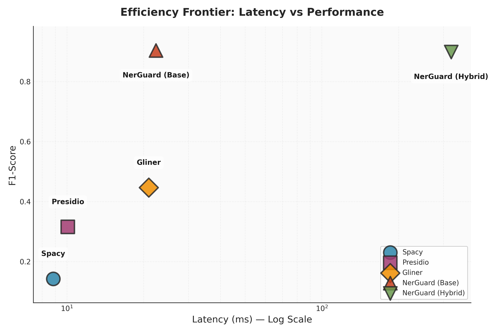
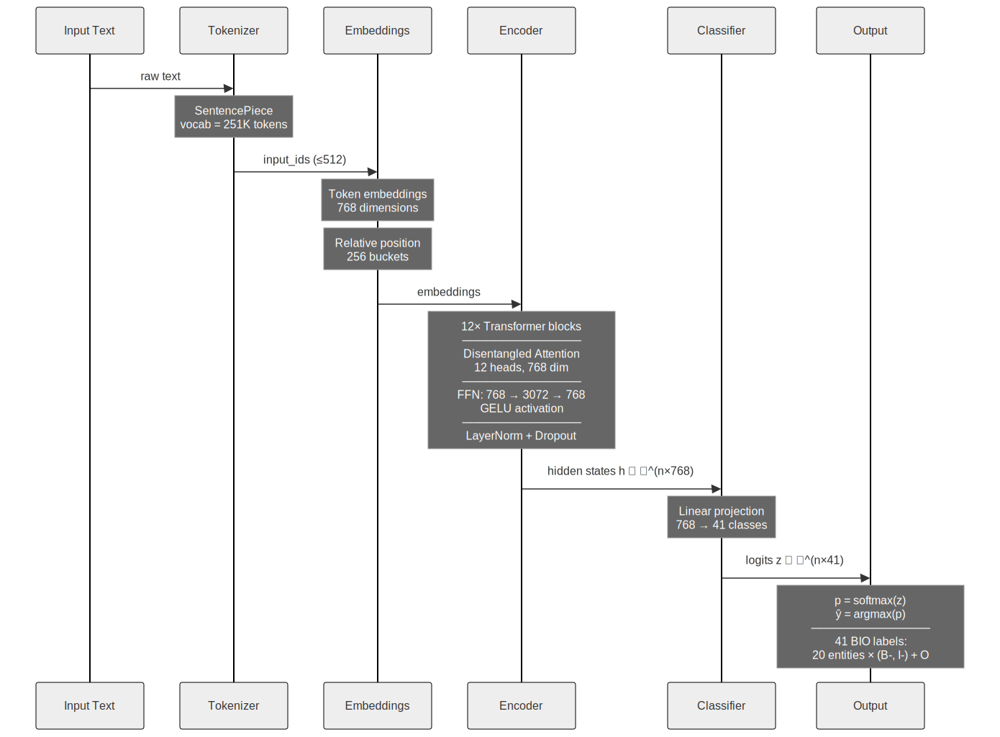
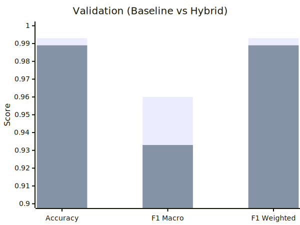
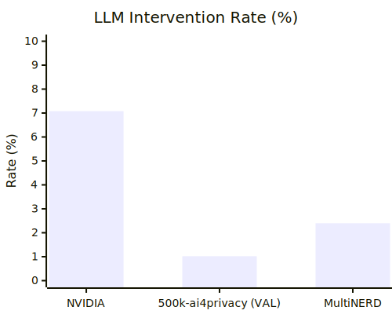
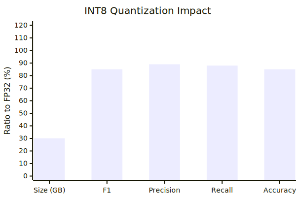
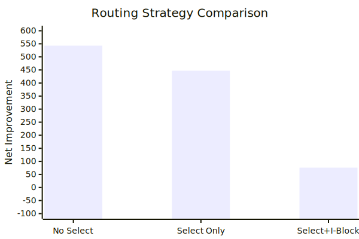
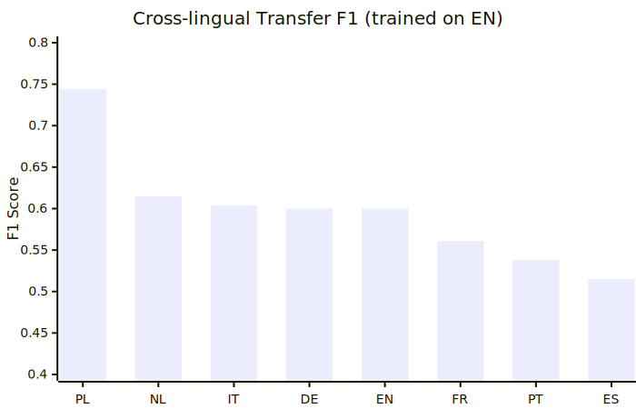

<div align="center">
  <h1>NerGuard</h1>
  <p>
    <strong>Hybrid PII Detection with Entropy-Based LLM Routing</strong><br>
    <em>Master's Thesis in Data Science</em><br>
    University of Verona, Department of Computer Science
  </p>
</div>

<p align="center">
  <a href="https://www.python.org/"></a>
  <a href="https://pytorch.org/"></a>
  <a href="https://huggingface.co/"></a>
  <a href="https://wandb.ai/"></a>
  <a href="https://openai.com/"></a>
</p>

**NerGuard** is a PII (Personally Identifiable Information) detection system combining transformer-based NER with selective LLM routing. The system uses entropy-based uncertainty quantification to identify when local predictions are unreliable, routing only those cases to an LLM for disambiguation.

- Download the main model from HF: [exdsgift/NerGuard-0.3B](https://huggingface.co/exdsgift/NerGuard-0.3B)
- Download the quantized model from HF: [exdsgift/NerGuard-0.3B-onnx-int8](https://huggingface.co/exdsgift/NerGuard-0.3B-onnx-int8)

### Key Contributions

- **Hybrid Architecture**: Combines fast local inference (22ms) with selective LLM routing
- **Entropy-Based Routing**: Uses Shannon entropy to detect model uncertainty (only **0.57%** tokens routed)
- **Entity-Specific Routing**: +20.9% improvement on credit cards, +10.9% on phone numbers
- **Cost Efficient**: **78% cost savings** while maintaining 88.89% correction accuracy
- **Multilingual Support**: Cross-lingual transfer to 8 European languages (F1 up to 0.744)
- **2x Better**: Outperforms GLiNER, Presidio, and SpaCy by **>2x** on F1-score (0.904 vs 0.446)

<p align="center">
  
</p>

## Quick Start

### Installation

```bash
git clone https://github.com/yourusername/NerGuard.git
cd NerGuard
pip install -e .
```

### Environment Setup

```bash
cp .env.example .env
# Add your API key for LLM routing (optional)
echo "OPENAI_API_KEY=your_key_here" >> .env
```

### Run Demo

```bash
# Basic demo
python -m src.scripts.demo

# With custom text
python -m src.scripts.demo --text "Contact John Smith at john@email.com"

# With LLM routing enabled
python -m src.scripts.demo --llm-routing

# Detailed token analysis
python -m src.scripts.demo --detailed
```

### Python API

```python
from src.inference.tester import PIITester

# Initialize
tester = PIITester(llm_routing=False)

# Detect entities
text = "John Smith lives at 123 Main St. Email: john@email.com"
entities = tester.get_entities(text)

for e in entities:
    print(f"{e['label']}: {e['text']} (conf: {e['confidence']:.2%})")

# Redact text
redacted = tester.redact_text(text)
print(redacted)
```

---

## Architecture

<p align="center">
  
</p>

### Routing Criteria

LLM disambiguation is triggered when:
- `entropy > 0.583` AND `confidence < 0.787`

Thresholds optimized via grid search with bootstrap confidence intervals.

---

## Why LLM Router?

The selective LLM routing is the key innovation of NerGuard. Instead of routing all predictions to an expensive LLM, we use uncertainty quantification to identify only the tokens that need disambiguation.

### Efficiency Metrics

| Metric | Value |
|--------|-------|
| Tokens Routed | **0.57%** |
| Correction Accuracy | **88.89%** |
| Cost Savings | **78%** |
| Help:Harm Ratio | **2.2:1** |

### Entity-Specific Improvements

The LLM Router significantly improves detection of structured PII where the base model struggles:

| Entity Type | Without LLM | With LLM | Improvement |
|-------------|-------------|----------|-------------|
| Credit Card Number | 4.7% | 25.6% | **+20.9%** |
| Phone Number | 38.5% | 49.4% | **+10.9%** |
| Surname | 60.9% | 63.7% | +2.7% |
| Date | 82.3% | 84.3% | +2.0% |

<div align="center">
  
  <br><b>Validation Metrics</b>
  <br><br>
  
  <br><b>Intervention Rate</b>
  <br><br>
  
  <br><b>Quantization Impact</b>
  <br><br>
  
  <br><b>Selective Routing</b>
</div>

### How It Works

1. **Uncertainty Detection**: Compute entropy and confidence for each token prediction
2. **Selective Routing**: Only route tokens with `entropy > 0.583 AND confidence < 0.787`
3. **Entity Filtering**: Block I-continuation tokens (where LLM causes harm) and non-beneficial entity types
4. **LLM Disambiguation**: GPT-4o corrects uncertain predictions with 88.89% accuracy

---

## Project Structure

```
NerGuard/
├── src/
│   ├── core/                    # Core utilities
│   │   ├── constants.py         # Configuration values
│   │   ├── model_loader.py      # Model loading utilities
│   │   ├── label_mapper.py      # Label mapping
│   │   └── metrics.py           # Entropy/confidence computation
│   │
│   ├── inference/               # Inference pipeline
│   │   ├── tester.py            # PIITester class
│   │   ├── llm_router.py        # LLM routing with cache
│   │   ├── entity_router.py     # Entity-specific routing
│   │   └── prompts.py           # LLM prompt templates
│   │
│   ├── training/                # Model training
│   │   ├── trainer.py           # Training loop with W&B
│   │   ├── encoder.py           # Model architecture
│   │   └── validator.py         # Validation utilities
│   │
│   ├── evaluation/              # Evaluation scripts
│   │   ├── benchmark.py         # Multi-model benchmark
│   │   ├── nvidia_evaluator.py  # NVIDIA dataset evaluation
│   │   ├── hybrid_evaluator.py  # Hybrid system evaluation
│   │   ├── multilingual.py      # Cross-lingual evaluation
│   │   └── ablation_study.py    # Ablation studies
│   │
│   ├── optimization/            # Optimization tools
│   │   ├── threshold_optimizer.py  # Grid search
│   │   └── quantizer.py         # ONNX quantization
│   │
│   ├── visualization/           # Plotting utilities
│   │   ├── style.py             # Publication style
│   │   ├── plots.py             # Core plots
│   │   ├── benchmark_plots.py   # Benchmark visualizations
│   │   └── optimization_plots.py
│   │
│   ├── scripts/                 # Runnable scripts
│   │   └── demo.py              # Interactive demo
│   │
│   └── utils/                   # Utilities
│       ├── colors.py            # Terminal colors
│       ├── io.py                # File I/O
│       ├── logging_config.py    # Logging setup
│       └── samples.py           # Test samples
│
├── models/                      # Trained models
├── data/                        # Datasets
├── plots/                       # Generated figures
└── notebooks/                   # Analysis notebooks
```

---

## Supported Entities

NerGuard detects **21 PII entity types** using BIO tagging:

| Category | Entities |
|----------|----------|
| **Person** | `GIVENNAME`, `SURNAME`, `TITLE` |
| **Location** | `CITY`, `STREET`, `BUILDINGNUM`, `ZIPCODE` |
| **Government ID** | `IDCARDNUM`, `PASSPORTNUM`, `DRIVERLICENSENUM`, `SOCIALNUM`, `TAXNUM` |
| **Financial** | `CREDITCARDNUMBER` |
| **Contact** | `EMAIL`, `TELEPHONENUM` |
| **Temporal** | `DATE`, `TIME` |
| **Demographic** | `AGE`, `SEX`, `GENDER` |

---

## Evaluation Results

### Benchmark Comparison

NerGuard significantly outperforms all open-source alternatives on PII detection:

| Model | F1-Score | Latency (ms) | vs NerGuard |
|-------|----------|--------------|-------------|
| **NerGuard (Base)** | **0.904** | 22.4 | — |
| NerGuard (Hybrid) | 0.899 | 321.6 | -0.6% |
| GLiNER | 0.446 | 20.9 | **-50.7%** |
| Presidio | 0.315 | 10.1 | **-65.2%** |
| SpaCy | 0.142 | 8.8 | **-84.3%** |

*Evaluated on 3,000 samples. NerGuard achieves **2x better F1-score** than the best competitor.*

### LLM Router Ablation Study

The selective routing strategy is critical for efficiency and accuracy:

| Configuration | Net Improvement | F1-W | Routing Rate | LLM Calls |
|---------------|-----------------|------|--------------|-----------|
| No Selective | +543 | 0.679 | 2.40% | 2,448 |
| Selective Only | +447 | 0.682 | 1.78% | 1,820 |
| **Selective + I-Block** | **+89** | **0.690** | **0.57%** | 581 |

**Key Insight**: The optimal configuration (Selective + I-Block) achieves the best F1 score while routing only 0.57% of tokens, reducing API costs by **78%**.

### LLM Model Comparison

| Model | Correction Accuracy | Harm Rate | Cost/100 samples |
|-------|---------------------|-----------|------------------|
| **GPT-4o** | **88.89%** | 3.52% | $0.64 |
| GPT-4-turbo | 90.53% | 2.64% | $1.28 |
| GPT-3.5-turbo | 80.67% | 6.74% | $0.09 |
| GPT-4o-mini | 80.77% | 5.87% | $0.03 |

*GPT-4o provides the best balance of accuracy and cost.*

### Multilingual Evaluation

Cross-lingual transfer on WikiNeural dataset (8 European languages):

| Language | F1 Macro | Family |
|----------|----------|--------|
| Polish | **0.744** | Slavic |
| Dutch | 0.615 | Germanic |
| Italian | 0.604 | Romance |
| German | 0.600 | Germanic |
| English | 0.600 | Germanic |
| French | 0.561 | Romance |
| Portuguese | 0.538 | Romance |
| Spanish | 0.515 | Romance |

<p align="center">
  
</p>

### Performance on NVIDIA PII Dataset

| Metric | Score |
|--------|-------|
| Overall Accuracy | 93.22% |
| Weighted F1 | 95.17% |
| Macro F1 | 35.06% |

*Evaluated on 1,000 samples from NVIDIA/Nemotron-PII dataset.*

---

## Configuration

### Constants (`src/core/constants.py`)

```python
DEFAULT_MODEL_PATH = "./models/mdeberta-pii-safe/final"
DEFAULT_ENTROPY_THRESHOLD = 0.583
DEFAULT_CONFIDENCE_THRESHOLD = 0.787
MAX_CONTEXT_LENGTH = 512
OVERLAP = 128
```

### LLM Router

```python
from src.inference.llm_router import LLMRouter

router = LLMRouter(
    source="openai",        # or "ollama"
    model="gpt-4o-mini",
    enable_cache=True,
    cache_size=1000
)
```

---

## Training

```bash
# Train with default configuration
python -m src.training.trainer

# Custom configuration
python -m src.training.trainer \
    --model microsoft/mdeberta-v3-base \
    --epochs 3 \
    --batch-size 32 \
    --lr 2e-5
```

Training tracked with Weights & Biases.

---

## Benchmarking

```bash
# Run full benchmark
python -m src.evaluation.benchmark

# NVIDIA dataset evaluation
python -m src.evaluation.nvidia_evaluator

# Hybrid system evaluation
python -m src.evaluation.hybrid_evaluator

# Multilingual evaluation (8 languages)
python -m src.evaluation.multilingual --max-samples 1000

# Ablation study (routing strategies)
python -m src.evaluation.ablation_study --max-samples 500
```

---

## Citation

```bibtex
@mastersthesis{nerguard2026,
  title     = {Engineering a Scalable Multilingual PII Detection System with mDeBERTa-v3 and LLM-Based Validation},
  author    = {[Gabriele Durante]},
  year      = {2026},
  school    = {University of Verona},
  type      = {Master's Thesis},
  department = {Department of Computer Science}
}
```

---

## License

Academic research project. Contact the author for usage permissions.

---

<p align="center">
  <sub>Built with</sub>
</p>

<p align="center">
  <a href="https://pytorch.org/"></a>
  <a href="https://huggingface.co/"></a>
  <a href="https://wandb.ai/"></a>
  <a href="https://openai.com/"></a>
</p>
